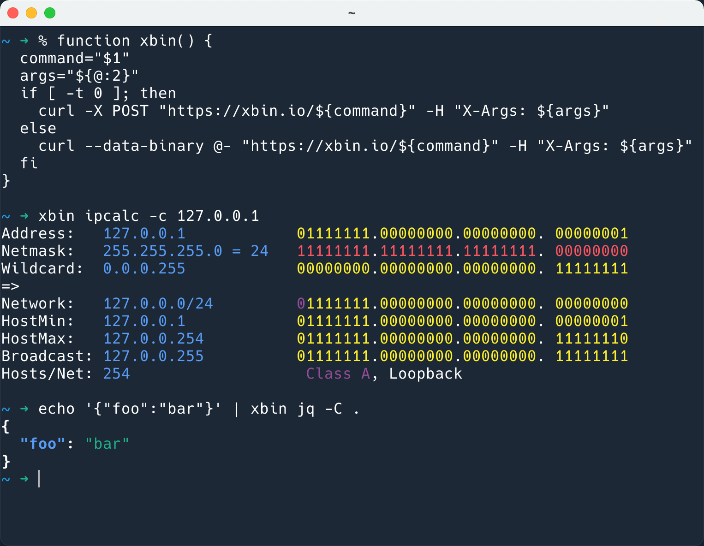
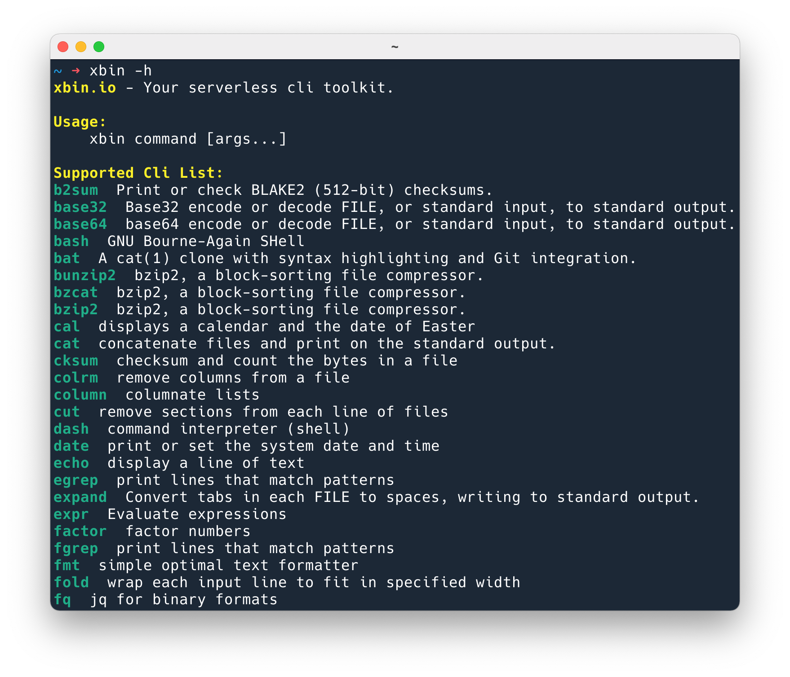

# xbin

Your serverless cli toolkit.

## Install

Copy and paste the content from [`xbin.zsh`](./xbin.zsh)(Or
[`xbin.sh`](./xbin.sh) if you use Bash, [`xbin.fish`](./xbin.fish) if you use
fish) to you current shell.

(This will work only for the current shell, if you want `xbin` always work under
your shell, you need to put the function (the content of the `xbin.zsh`) into
your `~/.zshrc`, so that `xbin` will be always available for you)

## Usage

Just put `xbin` before the command that you want to run.

Like this:



You can check the supported commands by `xbin -h` or `xbin --help`:



You can check if a command was supported or not, by this command:

```shell
$ xbin -h | xbin ansi2txt | xbin grep -i python
python2.7  Python is an interpreted, interactive, object-oriented, open-source programming language.
python3.10(python, python3)  Python is an interpreted, interactive, object-oriented, open-source programming language.
python3.6  Python is an interpreted, interactive, object-oriented, open-source programming language.
python3.8  Python is an interpreted, interactive, object-oriented, open-source programming language.
python3.7  Python is an interpreted, interactive, object-oriented, open-source programming language.
python3.9.12(python3.9)  Python is an interpreted, interactive, object-oriented, open-source programming language.
```

(`ansi2txt` is to remove the colors of output)

## Caveats

### Mind the Quotes!

If you have `"`(quotes) in your command args, you need to use single quotes to
quote all args.

Because of the commands' args was passed to xbin.io via HTTP headers, So
`xbin jq -C ".[0] | keys"` will be passed as `X-Args: -C .[0] | keys` in the
headers, then when xbin.io received your request, it will see `-C .[0] | keys`
as arg list, AKA, 4 args in this command: `-C` `.[0]` `|` `keys`. So the correct
way is calling like this: `xbin jq -C '".[0] | keys"'`, or
`xbin jq '-C ".[0] | keys"'`, then the double quotes will be kept in HTTP
headers: `X-Args: -C ".[0] | keys"`, xbin.io will think your command as
`jq -C ".[0] | keys"`, there are only two args, which is correct.

### Where Is My Colors?!

You may notice that if you run `jq` you will see colorize output, but when you
run `xbin jq` the color is gone. That is because normally the cli tools will
check if your current
[`istty(3)`](https://man7.org/linux/man-pages/man3/isatty.3.html) (test whether
your stdout refers to a terminal), if it is, then the cli will use colorize
output, otherwise use monochrome output.

But luckily that most of the cli provides the option that force the output to be
colorized. Like `jq -C`, `grep --color=always`, `bat --color=always`, etc. So
when you use `xbin` and want to see the colorized output, you should explicitly
add the colorized options.
